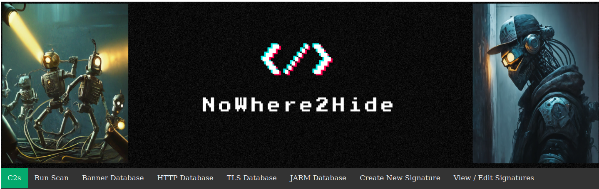
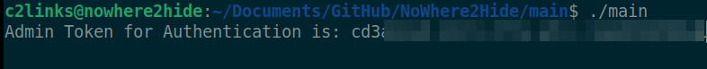
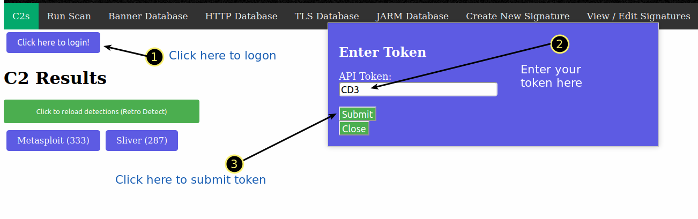
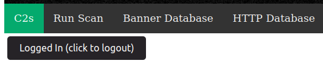
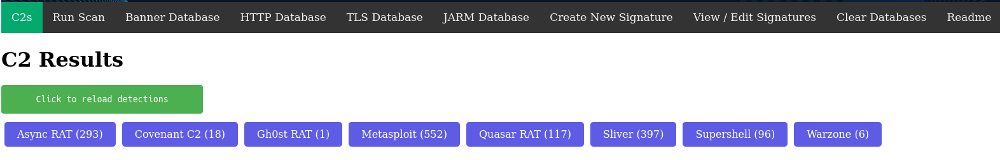

# NoWhere2Hide Active Scanner



***NoWhere2Hide*** is an open-source active scanner tailored for security researchers and professionals keen on investigating Command and Control (C2) infrastructures. Developed in GO, it leverages ZGRAB2 for scanning and utilizes a PostgreSQL database for storing scan data and detecting C2s.

NoWhere2Hide empowers threat researchers to pinpoint malicious infrastructures, craft C2 signatures, and continually monitor and authenticate C2s. It promotes innovative approaches to identifying malicious infrastructures, steering away from scanning the entire internet, and offers a structured format and framework for exchanging C2 signatures within our community.

My ultimate aim is to facilitate the effortless creation of detection signatures and their dissemination within the community for mutual scanning and detection. 

That being said, I've also tailored this tool for individuals like myself who conduct or aspire to conduct their own scanning activities, without necessarily having the means or inclination to share their signatures publicly.

## See it live -> https://www.nowhere2hide.info:6332/

# Installation

## Local Deployment

Tested and validated on Ubuntu 22.04, but should work wherever GO and Postgres can be installed.

I have created two videos to go over the installation process.

- Install GO: https://www.youtube.com/watch?v=DKvg6YVCwiU
- Install NoWhere2Hide: https://www.youtube.com/watch?v=CF4MWWnOs-w

### Install GO

Follow instructions -> https://go.dev/doc/install

### Clone Project

```git clone https://github.com/c2links/NoWhere2Hide.git```

### Install and Setup Postgres

```
sudo apt update
sudo apt install postgresql postgresql-contrib

sudo -u postgres createuser --interactive
<nowhere2hide>
y

sudo -u postgres psql -c "ALTER USER nowhere2hide PASSWORD 'nowhere2hide';"
sudo -u postgres createdb nowhere2hide
```
### Rebuild Plugins

NoWhere2Hide uses plugins for both collection and advanced detections. When you first run the program you will most likely get a error about the plugins being related to a different version. 

To fix, you will have to rebuild the plugins by executing the below commands or by running the supplied script, `rebuild_plugins.sh`. 

```
go build -buildmode=plugin -o plugin/targets/badasn/badasn.so plugin/targets/badasn/badasn.go 
go build -buildmode=plugin -o plugin/targets/censys/censys.so plugin/targets/censys/censys.go 
go build -buildmode=plugin -o plugin/targets/shodan/shodan.so plugin/targets/shodan/shodan.go 
go build -buildmode=plugin -o plugin/targets/ipsum/ipsum.so plugin/targets/ipsum/ipsum.go
go build -buildmode=plugin -o plugin/c2/Trochilus/trochilus_banner.so plugin/c2/Trochilus/trochilus_banner.go 
```

### Add API keys

While not necessary, if you have API keys (currently only support Shodan, Censys and HuntIO), you should add them in the `api.yaml` file. The current format of the file is below.

```
censys_api_id: "xxxxxxxx-xxxx-xxxx-xxxx-xxxxxxxxxxxx"
censys_secret: "xxxxxxxxxxxxxxxxxxxxxxxxxxxxxxxx"
shodan: "xxxxxxxxxxxxxxxxxxxxxxxxxxxxxxxx"
huntio: "xxxxxxxxxxxxxxxxxxxxxxxxxxxxxxxxxxxxxxxxxxxxxxxxxxxxxxxxxxxxxxxx"
```

### Run

To build and run, enter the below commands

```
go build .
./main
```

Navigate to http://localhost:6332 to get to the UI.

You can additionally set the port to use by supplying the port as a argument `./main -port 12345` 

By default the signatures are located in the folder, "../signatures", but this can also be changed by supplying the "signatures argument, `./main -signatures <path to signatures>`

### Authentication

NoWhere2Hide uses token(ish) authentication for most of its capabilities. A token is generated for you when you first start the program. The token is printed to the console for easy access but can be retrieved from the Postgres database at anytime.



Not all the actions of NoWhere2Hide require authentication. 

There is no authentication required for:
 - Viewing of detected C2's
 - Viewing and searching the scan data (banner,http,tls,jarm) or
 - Viewing signatures
 
 Authentication is required to: 
 - Run a scan
 - Create and / or modify signatures
 - Delete databases
 - Perform a retro hunt.

To authenticate, simply click on the "Click here to login" button and enter your token.



If all goes well the click here to logon button changes to the below (Logged In (click to logout))




## Install Using Docker Compose (Method 1)

This method involves cloning this who repo locally to build the docker container - recommend this method when doing development work

### Steps:

1. `git clone git@github.com:c2links/NoWhere2Hide.git && cd NoWhere2Hide`
2. Create a .env file and add the following to it:
   - If you don't have the key for a particular service, leave it blank.
```
POSTGRES_USER: nowhere2hide
POSTGRES_PWD: nowhere2hide
CENSYS_API_ID: <your censys api id>
CENSYS_SECRET: <your censys secret>
SHODAN: <your shodan api key>
HUNTIO: <your huntio api key>
```
3. Spin up docker compose: `sudo docker compose up -d`
   - Might need to wait a minute or 2 for things to get spun up.
4. Get the authentication code: `sudo docker exec nowhere2hide-hunter-1 cat /app/NoWhere2Hide/logs/auth.log`
   - if your docker instance is called something else, make sure to change the name in the command above
5. Open Firefox and go to http://localhost:6332/

## Install Using Docker Compose (Method 2)

This method involves checking out a smaller repo that contains just the necessary docker files to build and launch the project in docker.

### Steps:

1. `git clone git@github.com:xorhex/Docker_NoWhere2Hide.git && cd Docker_NoWhere2Hide`
2. Create a .env file and add the following to it:
   - If you don't have the key for a particular service, leave it blank.
```
POSTGRES_USER: nowhere2hide
POSTGRES_PWD: nowhere2hide
CENSYS_API_ID: <your censys api id>
CENSYS_SECRET: <your censys secret>
SHODAN: <your shodan api key>
HUNTIO: <your huntio api key>
```
3. Spin up docker compose: `sudo docker compose up -d`
   - Might need to wait a minute or 2 for things to get spun up.
4. Get the authentication code: `sudo docker exec docker_nowhere2hide-hunter-1 cat /app/NoWhere2Hide/logs/auth.log`
   - if your docker instance is called something else, make sure to change the name in the command above
5. Open Firefox and go to http://localhost:6332/


# Overview

Please see below for more details on how to use NoWhere2Hide. There are 5 main functions of NoWhere2Hide.

1. View detected C2's: Go here to see the C2's you have detected organized by malware family
2. Run a scan: Go here to run a scan based on one of the signatures you have created. Or one of the pre-built scans.
3. View scan results separated by scan results
    * Banner
    * HTTP
    * TLS
    * JARM
4. Create / Edit Signatures
5. Administration
    * Clear database
    * View logs (Future)
    * Readme

# Creating Your First Signature

Coming Soon

## Run your Scan
Coming Soon


## View Results
Coming Soon


## Modify Signature Add Detection
Coming Soon

## Reload Detections
Coming Soon


# View Detected C2's

Here you can click on any Malware Family to view the current list of C2's for that family.

The C2's are the result of the PostGres queries defined in the created signature (See above). There should be no duplicates in this list, when the C2 database is populated, if the same IP:PORT:Malware_Family combination already exists, the last scan time is modified, but a new entry is not created.




